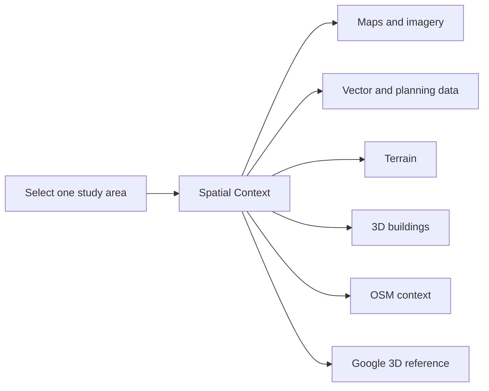

  

# RhinoSpatial

**Bring maps, terrain, buildings, imagery, and geodata into one aligned Rhino and Grasshopper site context.**

RhinoSpatial is a Grasshopper toolkit for working with real site context directly inside the design environment. Define a study area once with `Spatial Context`, then add the layers you need. Maps, terrain, imagery, buildings, vector data, and lightweight urban context are placed in one shared spatial framework so they line up.

It is designed for architects, urban designers, landscape architects, and anyone using Rhino or Grasshopper for site analysis, context modeling, concept design, and early-stage studies. The aim is a direct, lightweight workflow with sensible defaults—not a full GIS application inside Grasshopper.

[Website and user guide](https://pascalnun.eu/tools/rhinospatial/) · [Food4Rhino](https://www.food4rhino.com/en/app/rhinospatial?lang=en) · [Workflow guide](docs/SHOWCASE.md) · [Examples](examples/README.md) · [Releases](https://github.com/PascalNun/RhinoSpatial/releases)

## One area, multiple aligned layers

The central RhinoSpatial workflow is:

1. Define the project area once with `Spatial Context`.
2. Add maps, terrain, buildings, imagery, or vector data.
3. Combine the aligned results directly in Rhino and Grasshopper.

By default, RhinoSpatial moves real-world data near Rhino's origin. This keeps geometry practical to view and model while preserving alignment between layers. Projects that require original source coordinates can enable `Use Absolute Coordinates`.

## Install

The easiest installation path is Rhino 8's Package Manager:

1. Open Rhino 8.
2. Run `PackageManager`.
3. Enable **Include pre-releases** while RhinoSpatial remains in alpha.
4. Search for `RhinoSpatial`.
5. Install the package and restart Rhino or Grasshopper if requested.

You can also find RhinoSpatial on [Food4Rhino](https://www.food4rhino.com/en/app/rhinospatial?lang=en).

For manual installation, open [GitHub Releases](https://github.com/PascalNun/RhinoSpatial/releases), choose the current release, and download its `RhinoSpatial-…-alpha.zip` asset. See the [manual installation guide](package/food4rhino/INSTALL.md) for the Grasshopper Libraries locations on macOS and Windows.

Release packages include a small number of third-party libraries for raster handling, topology operations, coordinate transforms, and 3D tile decoding. Their licenses are documented in [Third-Party Notices](THIRD-PARTY-NOTICES.md).

## Your first RhinoSpatial workflow

1. Open Grasshopper and place `Spatial Context`.
2. Connect a Button to `Open Map`.
3. Click the button and draw the study area in the browser helper.
4. Connect the `Spatial Context` output to one or more source components.

If you already have a geospatial service or local project file, you can connect it to `Reference Source` before opening the map. RhinoSpatial uses its extent and coordinate-system metadata to open the map near the project. It does **not** load the referenced data; it only helps orient the area selector. This input is optional.

Good first combinations are:

- `Load WMS` plus `Load WFS` for imagery and planning or parcel data
- `Load GeoTIFF` plus `Load Terrain` for a local raster and ground surface
- `Load LoD2 Buildings` plus `Load Terrain` for official 3D building context
- `Load OSM` for quick figure-ground, black-plan, and general urban context
- `3D Tiles Viewer (Google)` for optional visual comparison with Google Photorealistic 3D Tiles

For a visual walkthrough, open the [RhinoSpatial workflow guide](docs/SHOWCASE.md). Downloadable Grasshopper definitions are available from the [example overview](examples/README.md).

## What you can bring into Rhino

| Design need | Component | Typical sources and result |
| --- | --- | --- |
| Select and place the project area | `Spatial Context` | One shared study area and placement context for every layer |
| Planning, parcel, boundary, road, or other vector data | `Load WFS` | WFS, OGC API Features, Shapefile, or GeoJSON; curves and points grouped by layer and feature |
| Maps, aerial imagery, orthophotos, or raster overlays | `Load WMS` | WMS imagery placed as an aligned image mesh and material |
| Local georeferenced imagery | `Load GeoTIFF` | A local `.tif` or `.tiff` placed in the same study space |
| Ground and elevation context | `Load Terrain` | WCS, GeoTIFF DEM, Esri ASCII Grid, XYZ/CSV grid, or a small-area fallback; aligned terrain meshes |
| Official 3D building and roof geometry | `Load LoD2 Buildings` | WFS, CityGML/GML/XML, CityJSON, folder, or ZIP archive; building Breps |
| Fast urban and landscape context | `Load OSM` | OpenStreetMap buildings, roads, water, green areas, and rail |
| Photogrammetric visual reference | `3D Tiles Viewer (Google)` | Temporary preview meshes and materials using your own Google Maps API key |

`List WFS Layers` and `List WMS Layers` help inspect the layers offered by a service before loading them.

The component names remain stable for existing Grasshopper definitions. In particular, `Load WFS` now covers a broader vector workflow than its original name suggests: it also accepts OGC API Features, local Shapefiles, and local GeoJSON.

See the [Component and Source Reference](docs/COMPONENT_REFERENCE.md) for supported formats, inputs and outputs, coordinate-system behavior, automatic fallbacks, diagnostic status messages, and detailed workflow notes.

## Current status

RhinoSpatial is in active alpha development. The current `v0.3.3-alpha` line contains the complete planned source set: Spatial Context, vector data, imagery, terrain, LoD2 buildings, GeoTIFF, OSM, and the optional Google 3D Tiles reference viewer.

The toolkit has been exercised against a growing international set of public services and local formats. Individual providers, coordinate systems, geometry types, service versions, API access rules, and file metadata can still expose edge cases. For project work, prefer official or project-specific sources and keep an older working definition when testing a new alpha release.

The [changelog](CHANGELOG.md) records release changes. The [test source catalogue](docs/TEST_SOURCES.md) documents the current compatibility set and known provider limitations.

## Design principles

RhinoSpatial is intended to remain:

- direct and understandable in Grasshopper
- useful for site analysis and contextual modeling
- built around one shared spatial context
- practical near the Rhino origin by default
- compatible with official project data first and broad contextual fallbacks second
- honest about source limitations through clear status messages
- lightweight rather than overloaded with low-level GIS controls

The goal is not to recreate a full GIS desktop application, build a giant provider browser, or expose every service parameter. The [project scope](docs/PROJECT_SCOPE.md) records the complete product boundaries and technical principles.

## Documentation

### Learn and use RhinoSpatial

- [Website and user guide](https://pascalnun.eu/tools/rhinospatial/)
- [Workflow guide with screenshots](docs/SHOWCASE.md)
- [Downloadable Grasshopper examples](examples/README.md)
- [Installation guide](package/food4rhino/INSTALL.md)

### Components and sources

- [Component and Source Reference](docs/COMPONENT_REFERENCE.md)
- [Curated example source list](examples/sources.json)
- [Tested provider and format catalogue](docs/TEST_SOURCES.md)

### Project and development

- [Project scope and design principles](docs/PROJECT_SCOPE.md)
- [Roadmap](docs/ROADMAP.md)
- [Manual validation checklist](examples/VALIDATION.md)
- [Changelog](CHANGELOG.md)
- [Third-party notices](THIRD-PARTY-NOTICES.md)

## Repository structure

- `RhinoSpatial` — Grasshopper components and Rhino-specific output builders
- `RhinoSpatial.Core` — reusable geospatial clients, readers, parsing, filtering, and coordinate logic
- `RhinoSpatial.Sandbox` — command-line probes and deterministic checks for core behavior outside Grasshopper

All layer components consume the same shared spatial context. That common selection, coordinate, placement, and elevation logic is the central architectural rule of the project.

## License and feedback

RhinoSpatial is released under the [MIT License](LICENSE).

Feedback, bug reports, provider edge cases, and additional real-world test datasets are welcome through [GitHub Issues](https://github.com/PascalNun/RhinoSpatial/issues).
