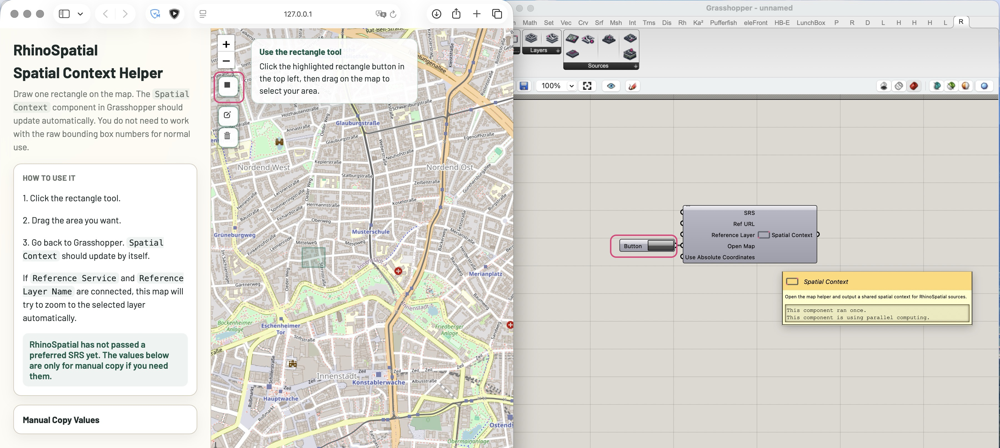
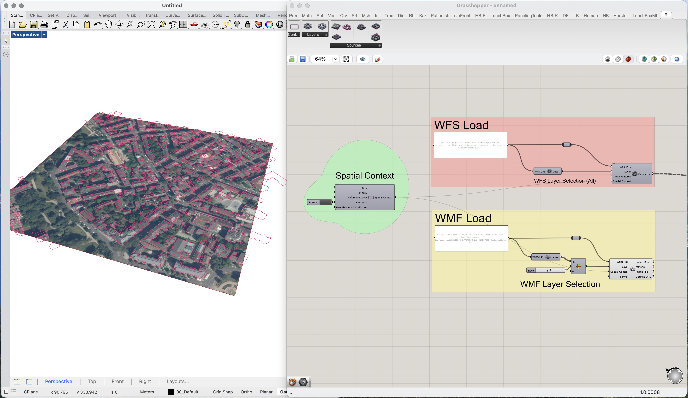
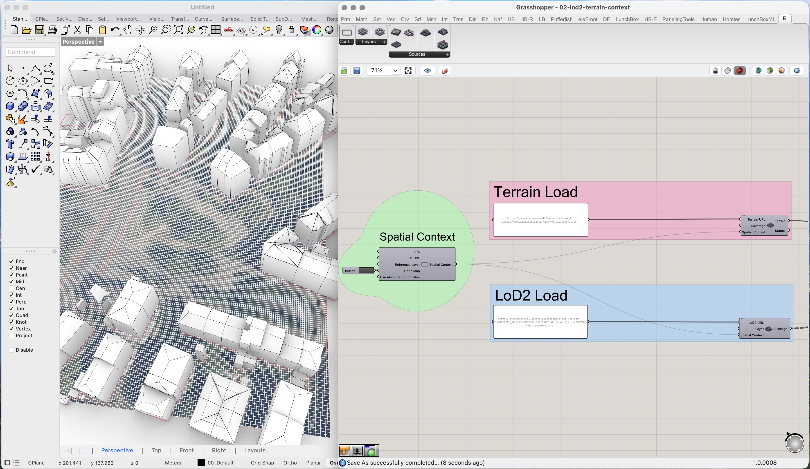
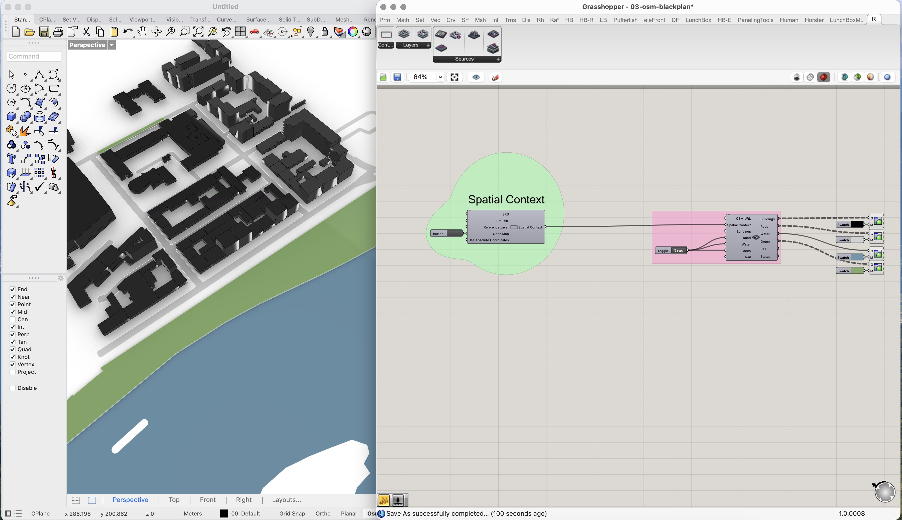

# Showcase

This file tracks the small set of visuals that best explain RhinoSpatial.

The goal is not to produce a huge gallery. The goal is to create a compact set
of screenshots that clearly show the intended workflow:

- one shared `Spatial Context`
- multiple aligned sources
- direct use inside Rhino and Grasshopper

## Available Assets

Example definitions:

- `../examples/gh/01-wfs-wms-basics.gh`
- `../examples/gh/02-lod2-terrain-context.gh`
- `../examples/gh/03-osm-blackplan.gh`

Available screenshots:

- `images/00-spatial-context-selection.jpg`
- `images/01-wfs-wms-basics.jpg`
- `images/02-lod2-terrain-context.jpg`
- `images/03-osm-blackplan.jpg`

## Target Visuals

### 1. Spatial Context Selection

Purpose:
- show the central starting point of the RhinoSpatial workflow
- make the shared-area idea understandable at a glance

Suggested setup:
- `Spatial Context`
- open map helper with a visible selected area

Capture goals:
- Grasshopper definition visible
- map helper visible at the same time if practical
- selected study area clearly shown on the map
- the screenshot should communicate:
  - define the area once
  - reuse it across the rest of the toolkit

### 2. WFS + WMS Basics

Purpose:
- show the simplest official-vector + imagery workflow
- communicate the "directly in Rhino/Grasshopper" idea quickly

Suggested sources:
- `wfs-hessen-reference`
- `wms-hessen-imagery`

Capture goals:
- `Spatial Context` visible in Grasshopper
- `Load WMS` raster aligned under `Load WFS` geometry
- Rhino viewport and Grasshopper definition both visible if practical

### 3. LoD2 + Terrain Context

Purpose:
- show that RhinoSpatial handles more than flat 2D data
- communicate shared XY and sensible local Z behavior

Suggested sources:
- `lod2-hessen-buildings`
- `terrain-hessen-dgm1`

Capture goals:
- terrain and building context loaded from the same `Spatial Context`
- building massing clearly sitting on a terrain base
- view angle that shows both roof geometry and ground relationship

### 4. OSM Black-Plan Context

Purpose:
- show the lightweight contextual workflow
- communicate the design-study intent clearly

Suggested sources:
- `osm-default`

Capture goals:
- buildings, roads, green, water, and rail where available
- clean figure-ground / context-plan readability
- avoid messy or provider-specific edge cases for the public screenshot set

## Capture Guidance

- Prefer clean, readable scenes over maximal data density.
- Use areas where the source quality is already known to behave well.
- Keep the Grasshopper canvas tidy in screenshots.
- Show only the components needed to explain the workflow.
- If one source is the main focus of a screenshot, dim or simplify the others.

## File Naming Suggestion

Use this naming scheme for showcase screenshots:

- `00-spatial-context-selection.jpg`
- `01-wfs-wms-basics.jpg`
- `02-lod2-terrain-context.jpg`
- `03-osm-blackplan.jpg`
