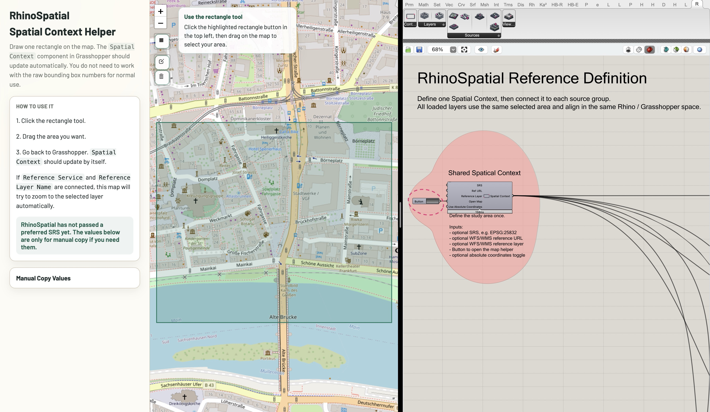
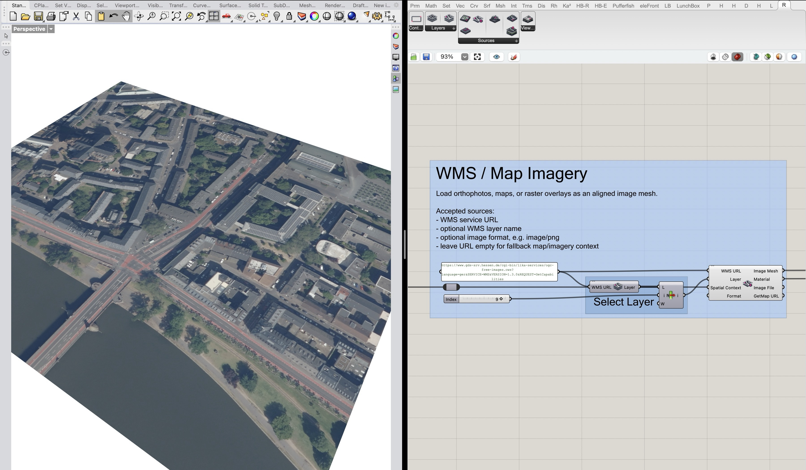
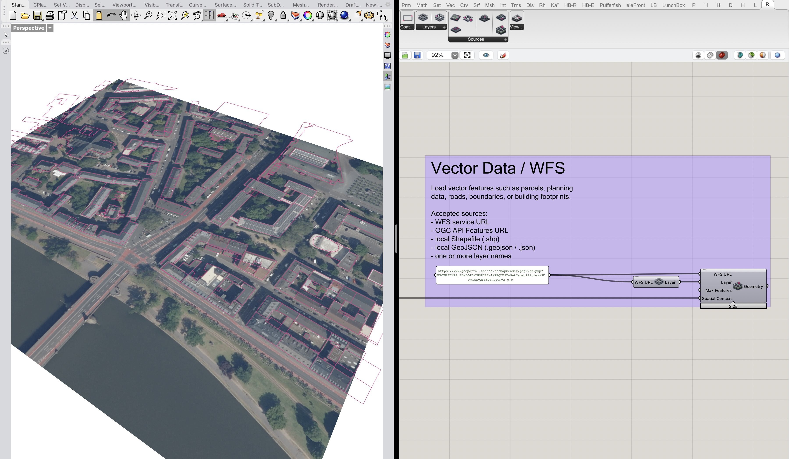
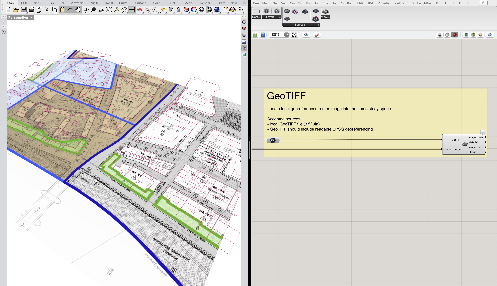
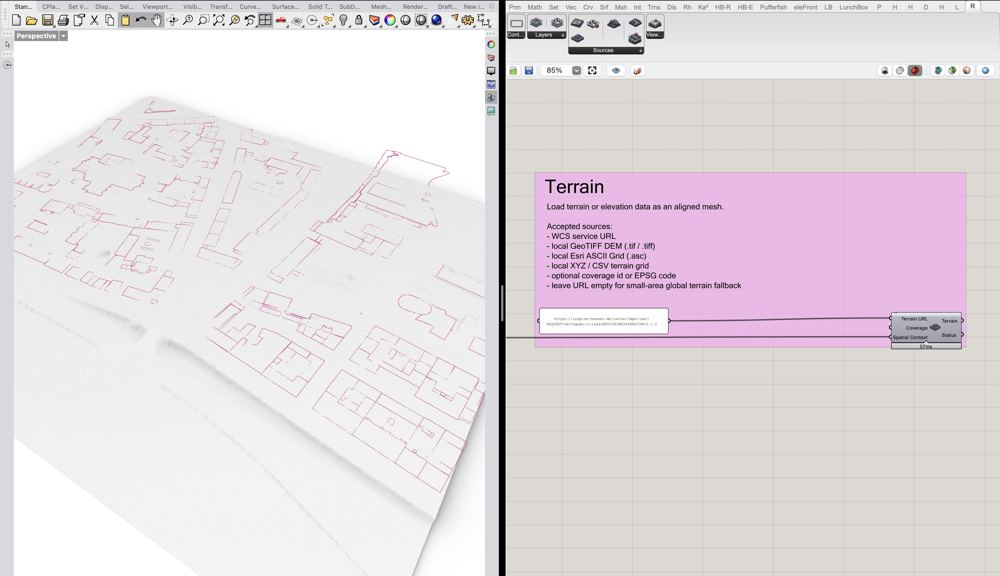
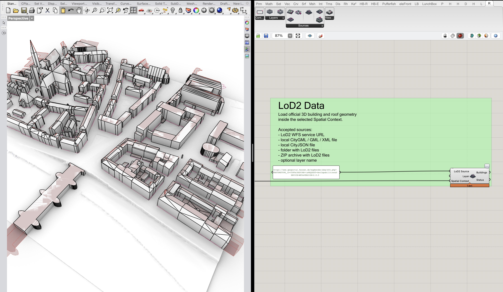
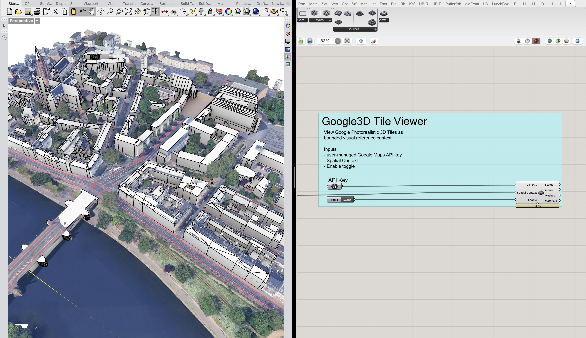
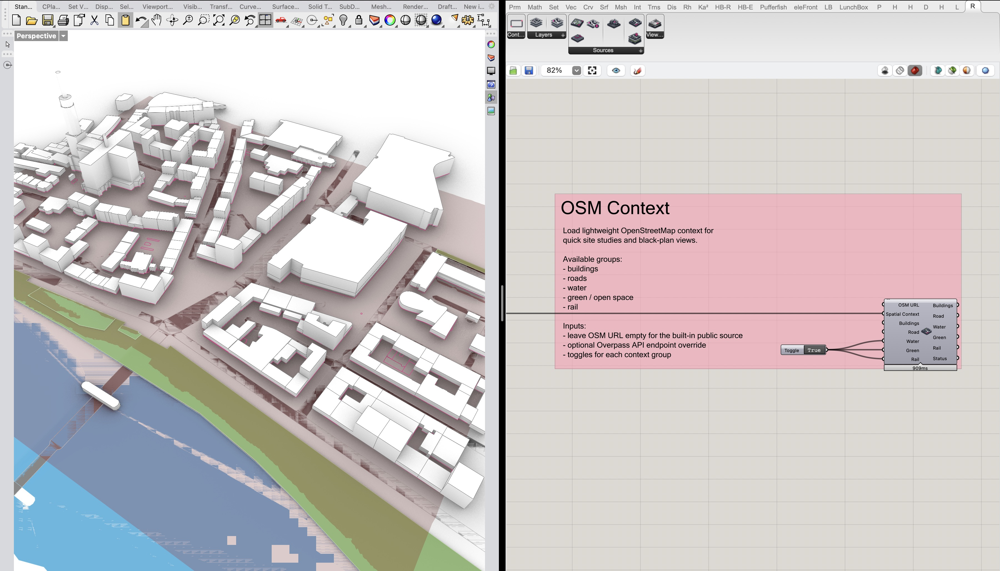

# Workflow Tutorial

RhinoSpatial is built around one selected area and multiple aligned source
groups. This walkthrough shows the reference definition flow: start with one
shared `Spatial Context`, then connect WMS, WFS, GeoTIFF, terrain, LoD2,
Google 3D Tiles, and OSM source blocks to that same context.

The URLs and files shown in the screenshots are examples. They can be replaced
with your own project data as long as the source type is supported.

Related example definitions:

- [Full reference workflow](../examples/gh/00-rhinospatial-reference-workflow.gh)
- [WMS + WFS basics](../examples/gh/01-wms-wfs-basics.gh)
- [GeoTIFF + terrain](../examples/gh/02-geotiff-terrain.gh)
- [LoD2 buildings](../examples/gh/03-lod2-buildings.gh)
- [OSM context](../examples/gh/04-osm-context.gh)
- [Google 3D Tiles reference](../examples/gh/05-google-3d-tiles-reference.gh)

## 0. Spatial Context

Start with `Spatial Context`. Open the map helper, draw one rectangle, and use
the resulting context output for every source group.

Supported inputs include an optional SRS, optional WFS/WMS reference URL and
layer, an `Open Map` button, and an optional absolute-coordinates toggle.

## 1. WMS / Map Imagery

Use `Load WMS` to bring orthophotos, maps, or raster overlays into Rhino as an
aligned image mesh.

Supported inputs include a WMS service URL, an optional WMS layer name, and an
optional image format such as `image/png`. If the URL is left empty,
RhinoSpatial can use fallback map/imagery context for quick orientation.

## 2. Vector Data / WFS

Use `Load WFS` for vector features such as parcels, planning data, roads,
boundaries, or building footprints.

Supported inputs include WFS service URLs, OGC API Features URLs, local
Shapefiles (`.shp`), local GeoJSON files (`.geojson` / `.json`), and one or
more layer names.

## 3. GeoTIFF

Use `Load GeoTIFF` to place a local georeferenced raster image inside the same
study space.

Supported inputs include local GeoTIFF files (`.tif` / `.tiff`) with readable
EPSG georeferencing.

## 4. Terrain

Use `Load Terrain` to create an aligned elevation mesh for the selected study
area.

Supported inputs include WCS service URLs, local GeoTIFF DEM files, local Esri
ASCII Grid files (`.asc`), local XYZ/CSV terrain grids, and an optional
coverage id or EPSG code. If the terrain URL is left empty, RhinoSpatial can
use a small-area global terrain fallback.

## 5. LoD2 Buildings

Use `Load LoD2 Buildings` to load official 3D building and roof geometry inside
the selected Spatial Context.

Supported inputs include LoD2 WFS service URLs, local CityGML/GML/XML files,
local CityJSON files, folders with LoD2 files, ZIP archives with LoD2 files,
and optional layer names.

## 6. Google 3D Tiles Reference

Use `3D Tiles Viewer (Google)` as bounded visual reference context for the
selected area.

This workflow is optional. It requires a user-managed Google Maps Platform API
key for the Google Map Tiles API, the shared Spatial Context, and an enable
toggle. RhinoSpatial does not include, store, or share a Google API key.

To try this block, create or use a Google Cloud project, enable the
[Map Tiles API](https://developers.google.com/maps/documentation/tile/get-api-key),
create an API key in the Google Cloud credentials page, and paste that key into
the `API Key` input. Keep the key out of committed example files, and restrict
the key in Google Cloud where possible.

Google Map Tiles API requests can count toward quota and billing, so keep the
viewer disabled when you are not actively using it and check the current
[Google usage and billing documentation](https://developers.google.com/maps/documentation/tile/usage-and-billing).

This is a visual reference viewer, not an editable project data import, bake,
export, or offline cache workflow. When using Google Photorealistic 3D Tiles,
review the current [Google Maps Platform Terms of Service](https://cloud.google.com/maps-platform/terms)
and [Map Tiles API Policies](https://developers.google.com/maps/documentation/tile/policies),
including attribution requirements and restrictions on caching, extraction, and
offline use.

## 7. OSM Context

Use `Load OSM` for lightweight OpenStreetMap context and quick black-plan style
site studies.

Available context groups include buildings, roads, water, green/open space,
and rail. Leave the OSM URL empty to use the built-in public source, or provide
an Overpass API endpoint as an advanced override.

